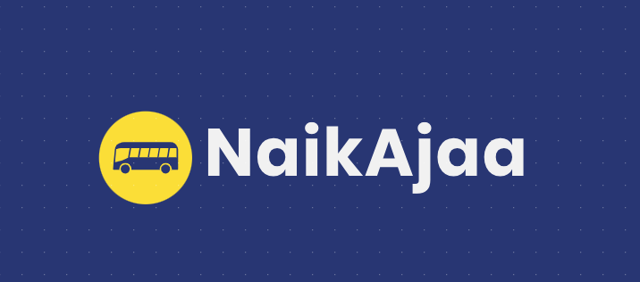

# 🚌 NaikAjaa - Blockchain E-Ticketing System


**NaikAjaa** adalah platform pemesanan tiket bus berbasis Web3 yang mengintegrasikan pembayaran konvensional (Midtrans) dengan teknologi Blockchain (Ethereum). Setiap tiket yang dibeli dicetak otomatis (*minted*) menjadi NFT (ERC-721) sebagai bukti kepemilikan yang *immutable* dan anti-pemalsuan.

---

## 🚀 Fitur Utama

- **Hybrid Architecture:** Integrasi mulus antara Web2 (Database) dan Web3 (Blockchain).
- **Automated Minting:** Tiket dicetak otomatis ke Blockchain setelah pembayaran Midtrans sukses (Webhook).
- **Gasless User Experience:** Penumpang tidak perlu membayar Gas Fee; transaksi ditangani oleh server.
- **QR Code Verification:** Validasi tiket transparan menggunakan Hash Transaksi Blockchain.
- **Seat Management:** Pemilihan kursi interaktif dan *real-time*.

---

## 🛠️ Teknologi yang Digunakan

### Frontend
- **React.js (Vite)** - Antarmuka Pengguna.
- **Bootstrap & SweetAlert2** - UI/UX Styling.
- **Ethers.js** - Interaksi dengan Smart Contract.

### Backend
- **Node.js & Express** - Server Logic.
- **MongoDB Atlas** - Database Penyimpanan Data User/Order.
- **Web3.js** - Interaksi Server-to-Blockchain.
- **Midtrans Snap** - Payment Gateway.

### Blockchain
- **Solidity** - Smart Contract (ERC-721).
- **Sepolia Testnet** - Jaringan Deployment.
- **Hardhat/Remix** - Development Environment.

### DevSecOps Tools
Proyek ini menerapkan prinsip keamanan sejak dini (*Shift-Left Security*):
- 🛡️ **Plan:** Threat Modeling (STRIDE).
- 🔍 **Dev:** ESLint untuk Static Code Analysis (SAST).
- 📦 **Build:** `npm audit` untuk pengecekan dependensi.
- ⚡ **Test:** OWASP ZAP untuk Dynamic Application Security Testing (DAST).
- 🚀 **Release:** CI/CD Pipeline via Vercel & GitHub Actions.

---

## 📸 Screenshots

| Landing Page | Booking Seat |
| :---: | :---: |
|  | *(Masukkan Screenshot Pilih Kursi)* |

| E-Ticket NFT | Security Scan (ZAP) |
| :---: | :---: |
| *(Masukkan Screenshot Tiket)* | *(Masukkan Screenshot ZAP)* |

*(Catatan: Ganti path gambar di atas dengan file gambar asli di folder kamu)*

---

## 📦 Instalasi & Menjalankan Project

Ikuti langkah berikut untuk menjalankan proyek di komputer lokal:

### 1. Clone Repository
```bash
git clone [https://github.com/username-kamu/NaikAjaa-Project.git](https://github.com/username-kamu/NaikAjaa-Project.git)
cd NaikAjaa-Project